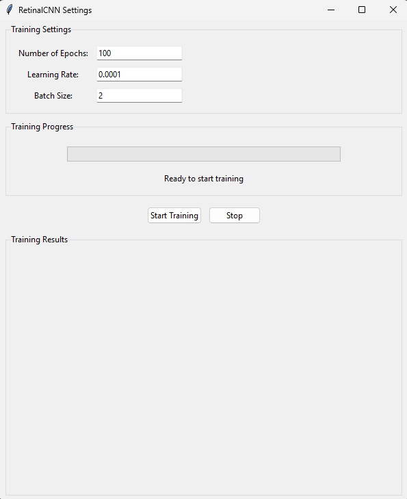

# AI-Retinal-blood-vessel-CNN
This code implements a Convolutional Neural Network (CNN) for retinal blood vessel segmentation in medical images. Here are the key aspects:



Purpose: It processes retinal fundus images to automatically detect and segment blood vessels, which is valuable for diagnosing various eye conditions.

Update 29.01.2025:
-Full GUI integration with the RetinalCNN model 
-Real-time training progress updates 
-Parameter control through the interface 
-Proper data loading and preprocessing 
-Model architecture setup 
-Training visualization capabilities 
-Error handling and user feedback 


Main components:

-Custom CNN architecture with left (ConLayerLeft) and right (ConLayerRight) convolutional layers
-Training pipeline using the DRIVE dataset (Digital Retinal Images for Vessel Extraction)
-Image preprocessing and normalization
-Visualization of results including original images, ground truth masks, and generated segmentation masks

Training process:
-Uses 128 training images of size 256x256 pixels
-Runs for 100 epochs with a batch size of 2
-Implements gradient-based optimization using Adam optimizer
-Saves progress visualizations in the 'train_change' directory

Output:
-Generates vessel segmentation masks
-Creates comparison visualizations showing:
-Original retinal images
-Ground truth vessel masks
-Generated vessel masks
-Overlay visualizations of vessels on original images

-This code is particularly useful in medical image analysis for automated detection of retinal vasculature, which can help in early diagnosis of conditions like diabetic retinopathy.

## Prerequisites

- Python 3.7+
- CUDA-compatible GPU (recommended)

## Installation

1. Clone the repository:
```bash
git clone https://github.com/yourusername/RetinalCNN.git

Create and activate a virtual environment:
python -m venv venv

source venv/bin/activate  # Linux/Mac
venv\Scripts\activate  # Windows

pip install tensorflow numpy scikit-learn matplotlib scikit-image

RetinalCNN/
├── DRIVE/
│   └── training/
│       ├── images/
│       │   └── *.tif
│       └── 1st_manual/
│           └── *.tif

Run the training script:
python main.py

```
-The training process will:
-Train for 100 epochs
-Save visualization results in train_change/ directory
-Display training progress and loss values
-Output
-The model generates:

-Original images
-Ground truth masks
-Generated vessel segmentation masks
-Overlay visualizations
-Results are saved every 2 epochs in the train_change/ directory.

-Model Architecture
-Input: 256x256 grayscale retinal images
-Output: Binary vessel segmentation masks
-Architecture: Custom CNN with left and right convolutional layers
-Loss: Mean Squared Error (MSE)
-Optimizer: Adam with learning rate 0.0001


